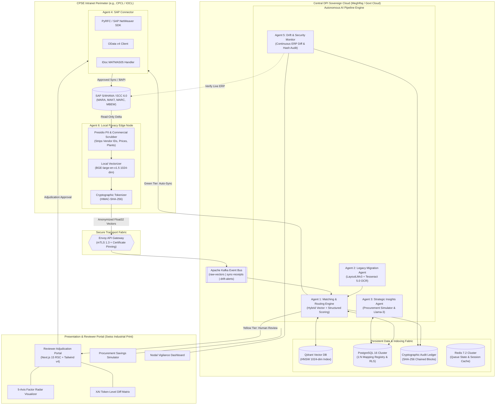
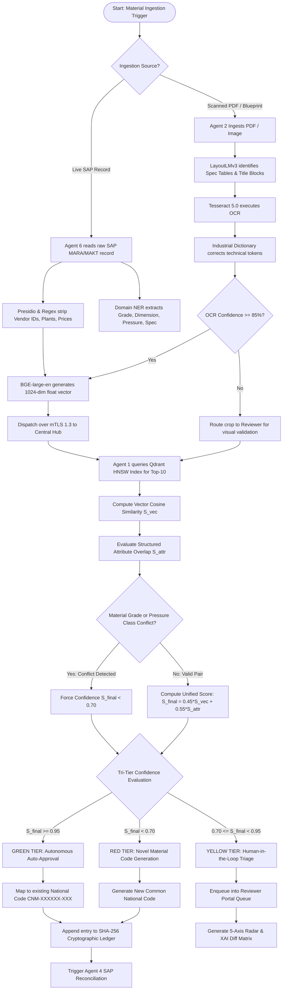
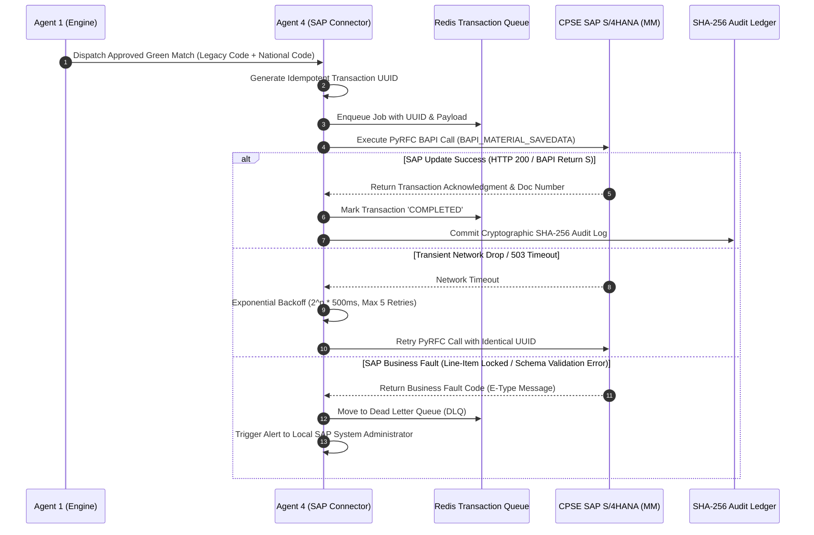
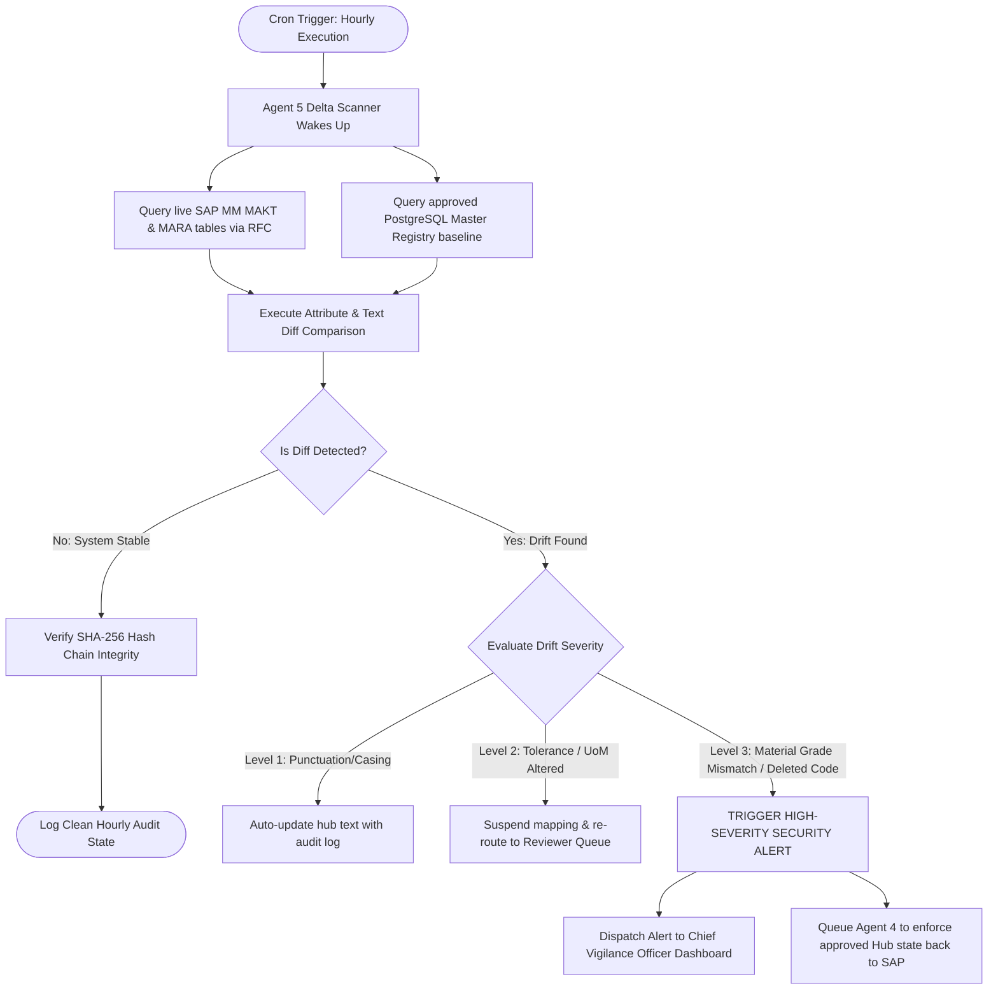
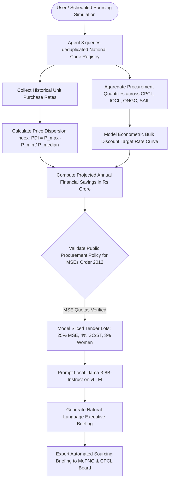

# Technical Stack, System Architecture & Process Workflows

**Project Title:** AI-Driven Standardization and Harmonization of Material Codes Across CPSEs  
**Standard Reference:** IEEE 1471 / ISO/IEC/IEEE 42010 Architecture Standard  
**Target Organization:** Ministry of Petroleum & Natural Gas (MoPNG) / Chennai Petroleum Corporation Limited (CPCL)  
**Pilot Testbed:** Chennai Petroleum Corporation Limited (CPCL) ↔ Indian Oil Corporation Limited (IOCL)  
**Document Version:** 2.0 (Master Engineering Specification)

> **Executive Summary:** This technical specification outlines the complete, open-source-first technology stack, federated sovereign system architecture, and detailed process workflows powering the "One Nation – One Material Code" digital public infrastructure. All core software components are 100% Free and Open-Source Software (FOSS) requiring zero recurring SaaS subscription fees.

---

## 1. Enterprise Technology Stack Matrix

The platform is constructed on an enterprise-grade, open-source-first stack deployed across on-premise CPSE edge nodes and the Sovereign Cloud (MeghRaj).

### 1.1 Complete Layer-by-Layer Technology Breakdown

| System Layer | Technology / Component | Version | Role & Architectural Purpose | License & Cost |
| :--- | :--- | :--- | :--- | :--- |
| **Presentation Layer** | **Next.js (App Router)** | `15.x` | React Server Components (RSC) architecture with zero client-bundle overhead. | MIT (**₹0 / Free**) |
| | **Tailwind CSS** | `v4.0` | Native CSS utility engine enforcing Swiss Industrial Print design tokens. | MIT (**₹0 / Free**) |
| | **Motion (fka Framer)**| `12.x` | Hardware-accelerated GPU micro-interactions (`transform` and `opacity`). | MIT (**₹0 / Free**) |
| | **Typography** | `Self/OFL` | `Geist Black` / `Neue Haas Grotesk` (headers) & `JetBrains Mono` (data). | SIL OFL (**₹0**) |
| **Edge Node (Spoke)** | **Microsoft Presidio** | `2.2.x` | Context-aware PII & commercial entity scrubbing (Vendor IDs, Prices, Plants). | MIT (**₹0 / Free**) |
| | **BGE-large-en-v1.5** | `1.5.0` | On-premise 1024-dimensional dense semantic vector embedding generation. | Apache 2.0 (**₹0**) |
| | **PyRFC Connector** | `3.3.x` | Direct C-extension binding to SAP NetWeaver RFC SDK for BAPI execution. | Apache 2.0 (**₹0**) |
| **Central AI Engine** | **Qdrant Vector DB** | `1.10.x` | Sub-250ms cosine similarity vector search across 10M+ SKUs (HNSW index). | Apache 2.0 (**₹0**) |
| | **DeBERTa-v3 / RoBERTa**| `v3-large`| Fine-tuned domain Named Entity Recognition (NER) for attribute parsing. | MIT (**₹0 / Free**) |
| | **LayoutLMv3** | `v3-base` | Multi-modal document transformer for parsing scanned legacy blueprints. | Open (**₹0 / Free**) |
| | **Tesseract OCR** | `5.4.x` | Optical character recognition with industrial dictionary spell-correction. | Apache 2.0 (**₹0**) |
| | **Llama-3-8B-Instruct**| `8B-AWQ` | Local quantized LLM on **vLLM** for automated executive briefings. | Llama 3 (**₹0**) |
| **Data & Messaging** | **PostgreSQL** | `16.3` | Relational master repository with partitioning, RLS, and JSONB stores. | PostgreSQL (**₹0**) |
| | **Apache Kafka** | `3.7.x` | High-throughput distributed event bus for streaming vectors and sync events. | Apache 2.0 (**₹0**) |
| | **Redis** | `7.2.x` | In-memory cache for reviewer queue state, optimistic UI locking, and tokens. | BSD-3 (**₹0 / Free**) |
| **Security & Gateway** | **SHA-256 Ledger** | `Native` | Cryptographically chained audit trail guaranteeing CAG compliance. | Standard (**₹0**) |
| | **Envoy Gateway** | `1.30.x` | Edge-to-Hub API gateway enforcing mutual TLS (mTLS 1.3) with cert pinning. | Apache 2.0 (**₹0**) |
| | **HashiCorp Vault** | `1.16.x` | Hardware Security Module (HSM) key management for signing audit blocks. | MPL 2.0 (**₹0**) |

---

## 2. System Architecture Design

### 2.1 Federated Sovereign Enterprise Architecture Diagram



---

## 3. Comprehensive Process Workflows

### 3.1 End-to-End Ingestion, Deduplication & Tri-Tier Resolution Workflow



---

### 3.2 Green Tier Autonomous SAP Reconciliation Sequence



---

### 3.3 Yellow Tier Human-in-the-Loop Reviewer Workflow

```mermaid
flowchart TD
    A[Yellow Tier Item Enqueued] --> B[Domain Reviewer opens Adjudication Queue]
    B --> C[Render Side-by-Side Dual Doppelrand Panels]
    C --> D[Plot 5-Axis Radar Chart & XAI Token Diff Table]
    
    D --> E{Reviewer Decision Action}
    
    E -->|Keyboard [ENTER]| F[APPROVE & MAP]
    E -->|Keyboard [ESC]| G[REJECT AS DUPLICATE]
    E -->|Keyboard [M]| H[MODIFY ATTRIBUTES]
    
    F --> I[Update PostgreSQL Mapping to 'MANUAL_APPROVED']
    I --> J[Append SHA-256 Ledger Entry with Reviewer ID & Timestamp]
    J --> K[Trigger Agent 4 SAP MM Sync]
    
    G --> L[Mark Candidate Unmatched]
    L --> M[Initiate New National Material Code Creation]
    
    H --> N[Open Inline Attribute Editor Modal]
    N --> O[Reviewer adjusts Grade / Dimension / Standard]
    O --> P[Re-compute Confidence Score]
    P --> C
```

---

### 3.4 Continuous Live ERP Drift & Security Monitoring Workflow



---

### 3.5 Strategic Sourcing & Procurement Savings Simulator Workflow



---

### Document Authorization & Sign-Off

| Prepared By | Target Organization |
| :--- | :--- |
| **ONMC Engineering & Core Architecture**<br>Digital Public Infrastructure | **Ministry of Petroleum & Natural Gas (MoPNG)**<br>Chennai Petroleum Corporation Limited (CPCL) |
